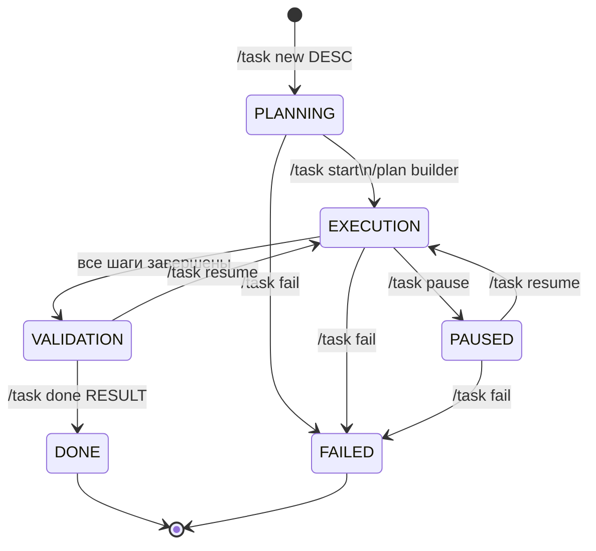

# Research: Граф зависимостей команд

## 1. Полный граф команд по пространствам имён

```
ПАРАМЕТРЫ МОДЕЛИ
  /model MODEL_ID               → state.model
  /base-url URL                 → state.base_url + пересоздание клиента
  /temperature FLOAT [0.0-2.0]  → state.temperature
  /max-tokens INT               → state.max_tokens
  /top-p FLOAT [0.0-1.0]        → state.top_p
  /top-k INT                    → state.top_k (через extra_body)
  /system-prompt TEXT           → state.system_prompt
  /initial-prompt TEXT          → state.initial_prompt

КОНТЕКСТ / СТРАТЕГИЯ КОНТЕКСТА
  /strategy sw|sf|br            → state.context_strategy
    sw = sliding_window  → build_context_sliding_window()
    sf = sticky_facts    → build_context_sticky_facts()
    br = branching       → build_context_branching()
  /showsummary                  → print state.context_summary [только sw]
  /showfacts                    → print state.sticky_facts.facts [только sf]
  /setfact KEY: VALUE           → state.sticky_facts.facts[key] = value [только sf]
  /delfact KEY                  → del state.sticky_facts.facts[key] [только sf]
  /checkpoint                   → state.last_checkpoint = create_checkpoint() [только br]
  /branch [NAME]                → state.branches.append(create_branch()) [только br, требует /checkpoint]
  /switch NAME_OR_ID            → state.active_branch_id [только br]
  /branches                     → print state.branches

ПАМЯТЬ (MEM)
  /memshow [all|short|working|long]  → print память соответствующего уровня
  /memstats                          → get_memory_stats() → файлы/размеры
  /memclear [all|short|working|long] → очистить in-memory (не файлы)
  /memsave [all|short|working|long]  → save_short_term() | save_working_memory() | save_long_term()
  /memload [all|short|working|long]  → load_short_term_last() | load_working_memory() | load_long_term()
  /settask TEXT                      → state.memory.working.current_task = TEXT
  /setpref KEY=VALUE                 → state.memory.working.user_preferences[key] = value
  /remember KEY: VALUE               → state.memory.long_term.knowledge_base[key] = value

ПРОФИЛЬ
  /profile show                      → print state.memory.long_term.profile
  /profile list                      → list_profiles() [все поддиректории dialogues/ с profile.json]
  /profile name NAME                 → profile.name = NAME + mkdir dialogues/NAME/ + save_profile()
  /profile style KEY=VALUE           → profile.style[key] = value + save_profile()
  /profile format KEY=VALUE          → profile.format[key] = value + save_profile()
  /profile constraint add TEXT       → profile.constraints.append(TEXT) + save_profile()
  /profile constraint del TEXT       → profile.constraints.remove(TEXT) + save_profile()
  /profile load NAME                 → load_profile(NAME) + load_last_session(NAME)
                                        + сброс: active_task_id, agent_mode, plan_dialog_state, branches, tokens

ЗАДАЧИ (TASK)
  /task new DESC                     → _create_task_plan(DESC) → LLM → TaskPlan + TaskStep[]
                                        + save_task_plan() + state.active_task_id = task_id
                                        + save_session() [сразу, для устойчивости к сбоям]
  /task show [TASK_ID]               → load_task_plan() + load_all_steps() → _print_task_plan()
  /task list                         → list_task_plans() → print список
  /task load TASK_ID                 → load_task_plan() + state.active_task_id = TASK_ID
  /task delete TASK_ID               → delete_task_plan() [shutil.rmtree]
  /task start [--plan NAME]          → _transition_plan(EXECUTION) [только из PLANNING]
  /task step done TEXT [--plan NAME] → step.result = TEXT + step.status = DONE
                                        + _advance_plan() [если последний → VALIDATION]
  /task step skip [--plan NAME]      → step.status = SKIPPED + _advance_plan()
  /task step fail TEXT [--plan NAME] → step.status = FAILED + step.notes = TEXT
  /task step note TEXT [--plan NAME] → step.notes += TEXT
  /task pause [--plan NAME]          → _transition_plan(PAUSED) [только из EXECUTION]
  /task resume [--plan NAME]         → _transition_plan(EXECUTION) [из PAUSED или VALIDATION]
  /task done RESULT [--plan NAME]    → собрать step.result → plan.result + _transition_plan(DONE)
                                        [только из VALIDATION]
  /task fail REASON [--plan NAME]    → plan.failure_reason = REASON + _transition_plan(FAILED)
  /task result [TASK_ID]             → _print_task_result() [только шаги с результатом + plan.result]

ПЛАН / AGENT РЕЖИМ (PLAN)
  /plan on                           → state.agent_mode.enabled = True
                                        + state.plan_dialog_state = "awaiting_task"
                                        + FSM онбординг: awaiting_task → awaiting_invariants → active
  /plan off                          → state.agent_mode.enabled = False
                                        + state.plan_dialog_state = None
  /plan status                       → print agent_mode (enabled, invariants count, max_retries)
  /plan retries N [1-10]             → state.agent_mode.max_retries = N
  /plan builder [--plan NAME]        → _run_plan_builder():
                                        EXECUTION → per-step: LLM → validate → retry → resolve → VALIDATION
  /plan result [TASK_ID]             → alias для /task result

ИНВАРИАНТЫ
  /invariant add TEXT                → state.agent_mode.invariants.append(TEXT)
  /invariant del N                   → state.agent_mode.invariants.pop(N-1)
  /invariant edit N NEW_TEXT         → analyze_invariant_impact() [LLM-проверка рисков]
                                        + требует подтверждения да/нет
                                        + invariants[N-1] = NEW_TEXT
  /invariant list                    → print с нумерацией
  /invariant clear                   → state.agent_mode.invariants = []

ПРОЕКТЫ (текущие команды)
  /project new NAME                  → Project() + save_project() + state.active_project_id = id
  /project list                      → list_projects()
  /project show                      → print активный проект
  /project switch ID                 → state.active_project_id = ID
  /project add-plan TASK_ID          → project.plan_ids.append(TASK_ID) + save_project()
  /project delete ID                 → delete_project() [shutil.rmtree]

СЕССИЯ
  /resume                            → load_last_session(profile_name) + _apply_session_data()
  /showsummary                       → print state.context_summary
```

---

## 2. Жизненный цикл задачи (Task Lifecycle)



---

## 3. Граф зависимостей (критические связи)

### Команды с предварительными условиями

| Команда | Требует | Зависит от |
|---------|---------|------------|
| `/branch NAME` | `/checkpoint` выполнен | `state.last_checkpoint` |
| `/switch NAME` | ветка существует | `state.branches` |
| `/plan builder` | активный план в PLANNING/EXECUTION | `state.active_task_id` |
| `/task step *` | план в фазе EXECUTION | `state.active_task_id` |
| `/task start` | план в фазе PLANNING | `state.active_task_id` |
| `/task done` | план в фазе VALIDATION | `state.active_task_id` |
| `/task pause` | план в фазе EXECUTION | `state.active_task_id` |
| `/task resume` | план в фазе PAUSED или VALIDATION | `state.active_task_id` |
| `/invariant edit N` | N-й инвариант существует | `state.agent_mode.invariants` |

### Команды с побочными эффектами на состояние

| Команда | Что сбрасывает | Что загружает |
|---------|---------------|--------------|
| `/profile load NAME` | active_task_id, agent_mode, plan_dialog_state, branches, tokens | profile, messages из последней сессии NAME |
| `/plan off` | plan_dialog_state | — |
| `/plan on` | — | FSM онбординг (awaiting_task) |
| `/memclear all` | short_term, working, long_term in-memory | — |

### Команды с LLM-вызовами (помимо основного диалога)

| Команда | Вызывает LLM для |
|---------|-----------------|
| `/task new DESC` | Генерации JSON-плана шагов |
| `/plan builder` (каждый шаг) | Выполнения шага + валидации против инвариантов |
| `/invariant edit N` | `analyze_invariant_impact()` — проверки рисков |
| `/plan on` → active фаза | Диалога планирования + парсинга Draft Plan |
| Sticky Facts стратегия | `extract_facts_from_llm()` после каждого обмена |
| Sliding Window стратегия | `summarize_messages()` каждые 10 сообщений |

### Конкурирующие команды (используют одни данные)

| Пара | Конфликт |
|------|---------|
| `/plan builder` + `/task step done` | Оба продвигают шаги одного плана |
| `/task execute` (alias builder) + `/task step` | То же |
| `/setfact` + автоматическое `extract_facts_from_llm()` | Оба изменяют `state.sticky_facts` |
| `/profile style` + `/setpref` | Оба хранят предпочтения (но в разных слоях) |

---

## 4. Поток данных при API-вызове

```
Пользователь вводит текст
  ↓
[Проверка: это /команда?]
  ├── да → parse_inline_command() → _apply_inline_updates() → continue
  └── нет → продолжить
  ↓
[FSM Plan-диалога активен?]
  ├── awaiting_task → _handle_plan_awaiting_task()
  ├── awaiting_invariants → _handle_plan_awaiting_invariants()
  ├── confirming → _confirm_and_create_tasks()
  └── нет → продолжить
  ↓
_append_message(ChatMessage(role="user"))
  ↓
build_context_by_strategy(
    strategy, messages, context_summary, facts, active_branch
)
  ↓
[Agent-режим активен?]
  ├── да → добавить build_agent_system_prompt() к context
  └── нет → использовать state.system_prompt
  ↓
client.chat.completions.create(model, messages=context, temperature, ...)
  ↓
[Agent-режим активен?]
  ├── да → validate_draft_against_invariants() → retry до max_retries
  │         parse_agent_output() → Response + State Update
  │         State Update → working.preferences
  └── нет → assistant_text = response.choices[0].message.content
  ↓
_append_message(ChatMessage(role="assistant", tokens=...))
  ↓
maybe_summarize() [если sliding_window + интервал]
  ↓
extract_facts_from_llm() [если sticky_facts]
  ↓
log_request_metric(RequestMetric, session_id, idx, profile_name)
  ↓
save_session(DialogueSession, session_path)
```

---

## 5. Алиасы команд

| Алиас | Нормализуется в |
|-------|----------------|
| `/strategy sw` | `sliding_window` |
| `/strategy sf` | `sticky_facts` |
| `/strategy br` | `branching` |
| `/memshow short` | `short_term` |
| `/memshow long` | `long_term` |
| `/memclear short` | `short_term` |
| `/plan result` | `/task result` |
| `/plan enable` | `/plan on` |
| `/plan disable` | `/plan off` |
| `/invariant update N` | `/invariant edit N` |

---

## 6. Функции в main.py (справочник)

### Хелперы

| Функция | Назначение |
|---------|-----------|
| `_now_iso()` | UTC timestamp ISO |
| `_parse_plan_flag(arg)` | Извлекает `--plan NAME` из строки аргумента |
| `_resolve_plan(state, name)` | Ищет план по имени или возвращает активный |
| `_require_active_plan(state)` | Активный план или ошибка |
| `_print_loaded_history(messages)` | Последние 5 обменов из загруженной сессии |
| `_print_strategy_status(state)` | Статус стратегии контекста |

### Управление задачами

| Функция | Назначение |
|---------|-----------|
| `_build_plan_prompt(description)` | Промпт для LLM-генерации шагов |
| `_parse_steps_from_llm_response(text)` | Парсинг JSON (3 слоя: json.loads → regex → fallback) |
| `_create_task_plan(desc, state, client)` | LLM → TaskPlan + TaskStep[] + сохранение |
| `_print_task_plan(plan, steps)` | Вывод плана с иконками статуса |
| `_print_task_result(plan, steps, state)` | Только результаты |
| `_transition_plan(plan, phase, state)` | Переход с проверкой ALLOWED_TRANSITIONS |
| `_advance_plan(plan, state)` | Следующий шаг или → VALIDATION |
| `_handle_step_subcommand(arg, state)` | done/skip/fail/note |

### Builder и Agent

| Функция | Назначение |
|---------|-----------|
| `_execute_builder_step(client, state, plan, step)` | Один шаг: LLM → validate → retry |
| `_run_plan_builder(state, client)` | Полный builder цикл |
| `_prompt_invariant_resolution(...)` | Интерактивный edit/remove/abort |
| `_handle_plan_dialog_message(...)` | LLM-диалог планирования |
| `_confirm_and_create_tasks(...)` | Создание TaskPlan из Draft Plan |

### Диспетчеры

| Функция | Команды |
|---------|--------|
| `_handle_agent_command()` | `/plan on|off|status|retries|builder` |
| `_handle_invariant_command()` | `/invariant add|del|edit|list|clear` |
| `_handle_project_command()` | `/project new|list|show|switch|add-plan|delete` |
| `_handle_task_command()` | `/task new|show|list|start|step|pause|resume|done|fail|result|delete|load` |
| `_apply_inline_updates()` | Главный диспетчер всех /команд |
