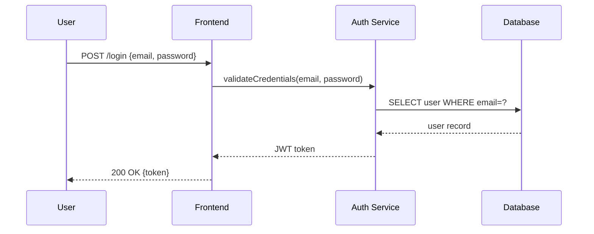

# Руководство: llm_local/main.py

## Запуск

```bash
cd /Users/igorpotema/mycode/ai_ad_ch6
python llm_local/main.py
```

При старте отобразится текущая конфигурация:
```
Модель: qwen3:14b | температура: 0.7 | max_tokens: 2048 | ctx: 4096 | preset: default
Команды: /model, /settings, /preset, /models, /benchmark, /status, /help, exit
```

---

## Задача 1 — Настройка параметров (`/settings`)

Три параметра управляют поведением генерации:

| Параметр | Что делает | Диапазон | Дефолт |
|----------|-----------|----------|--------|
| `temperature` | Случайность ответа. 0 = детерминированно, 2 = максимально случайно | 0.0–2.0 | 0.7 |
| `max_tokens` | Максимальная длина ответа в токенах | ≥ 1 | 2048 |
| `ctx` | Размер контекстного окна (сколько токенов модель "видит" назад) | ≥ 512 | 4096 |

### Примеры

```
# Точные, короткие ответы (для кода и архитектуры)
/settings temperature=0.2 max_tokens=1024 ctx=4096

# Творческие, развёрнутые ответы
/settings temperature=1.2 max_tokens=4096 ctx=8192

# Только температура
/settings temperature=0.5

# Большой контекст для длинных диалогов
/settings ctx=16384

# Несколько параметров сразу
/settings temperature=0.3 max_tokens=512 ctx=2048

# Проверить что применилось
/status
```

Вывод `/status`:
```
Модель: qwen3:14b | температура: 0.3 | max_tokens: 512 | ctx: 2048 | preset: default
```

---

## Задача 2 — Квантование

Квантование в Ollama работает **через имя модели** — никаких изменений в коде не нужно.
Квантованная модель занимает меньше RAM и работает быстрее, теряя минимум качества.

### Таблица вариантов (qwen3:14b)

| Модель | Квантование | Размер | Качество | Скорость |
|--------|-------------|--------|----------|----------|
| `qwen3:14b` | fp16 (по умолчанию) | ~9 GB | 100% | базовая |
| `qwen3:14b-q8_0` | Q8 | ~15 GB | ≈ fp16 | чуть быстрее |
| `qwen3:14b-q4_K_M` | Q4 Medium | ~8 GB | ~95% | +40% |
| `qwen3:14b-q4_K_S` | Q4 Small | ~7 GB | ~93% | +50% |
| `qwen3:8b-q4_K_M` | Q4 (8b) | ~5 GB | ~88% | +70% |

### Workflow

```bash
# 1. Посмотреть уже установленные модели
/models

# 2. Установить квантованную модель (в отдельном терминале)
ollama pull qwen3:14b-q4_K_M

# 3. Переключиться на неё в чате
/model qwen3:14b-q4_K_M

# 4. Проверить текущую модель
/status

# 5. Переключиться обратно при необходимости
/model qwen3:14b
```

Если RAM меньше 16 GB — рекомендуется `qwen3:8b-q4_K_M`.

---

## Задача 3 — Системный промпт для Архитектора (`/preset`)

Пресет `architect` включает системный промпт, который настраивает модель на работу
с архитектурными нотациями: **C4 Model**, **DFD**, **Sequence Diagrams** (PlantUML/Mermaid).

### Команды

```
/preset architect   — включить режим архитектора
/preset default     — выключить (без системного промпта)
/preset off         — то же что default
```

### Примеры запросов в режиме `architect`

```
# После включения пресета:
/preset architect

# C4 Context — общая картина системы
> Спроектируй платформу доставки еды. Покажи C4 Context диаграмму.

# C4 Container — сервисы и технологии
> Покажи C4 Container диаграмму для той же системы.

# C4 Component — внутренняя структура сервиса
> Детализируй сервис заказов до уровня C4 Component.

# DFD — потоки данных
> Нарисуй DFD для потока оплаты: пользователь → фронтенд → сервис оплаты → банк.

# DFD с границами доверия
> Построй DFD для регистрации пользователя. Отметь границы доверия между публичной зоной и внутренней сетью.

# Sequence Diagram — взаимодействие сервисов
> Покажи Mermaid sequence diagram: вход пользователя через JWT (фронтенд → auth-сервис → база данных).

# Sequence Diagram — сложный сценарий
> Нарисуй sequence diagram для оформления заказа: пользователь → API Gateway → сервис заказов → сервис склада → сервис уведомлений.

# Полный стек диаграмм
> Спроектируй приложение для вызова такси. Дай C4 Context, C4 Container и sequence diagram для бронирования поездки.

# Микросервисная архитектура
> Спроектируй бэкенд интернет-магазина на микросервисах. Покажи C4 Container со всеми сервисами и их взаимодействиями.
```

### Пример вывода (Sequence Diagram)

Модель ответит в формате:
````

````

---

## Задача 4 — Сравнение качества и скорости (`/benchmark`)

Команда запускает **3 стандартных вопроса** и замеряет время + скорость генерации.

```
/benchmark
```

Вывод:
```
=== Benchmark: qwen3:14b | temp=0.7 | max_tokens=2048 | ctx=4096 ===
Preset: default

[architecture] Design a simple payment processing service. Show C4 co...
  Время: 14.3s | Символов: 1842 | ~129 сим/с
  Ответ: The payment processing service consists of three main layers...

[coding] Write a Python function to parse a JWT token without external...
  Время: 8.1s | Символов: 743 | ~92 сим/с
  Ответ: def parse_jwt(token): parts = token.split('.') ...

[general] Explain the CAP theorem in three sentences...
  Время: 3.2s | Символов: 312 | ~98 сим/с
  Ответ: The CAP theorem states that a distributed system can provide ...

Итого: 25.6s | Средняя скорость: 112 сим/с
```

---

## Типичный сценарий оптимизации

### Шаг 1 — Базовый замер (до оптимизации)

```
/benchmark
```
Запишите результаты: время и символы/с.

### Шаг 2 — Включить архитектурный пресет + снизить температуру

```
/preset architect
/settings temperature=0.3 max_tokens=2048 ctx=8192
/benchmark
```

Ожидаемый эффект:
- Ответы структурированнее (C4/Mermaid вместо prose)
- Меньше "галлюцинаций" из-за низкой температуры
- Скорость примерно та же

### Шаг 3 — Переключиться на квантованную модель

```bash
# В другом терминале:
ollama pull qwen3:14b-q4_K_M
```

```
/model qwen3:14b-q4_K_M
/benchmark
```

Ожидаемый эффект:
- Скорость +30–40%
- Качество практически то же (~95%)

### Шаг 4 — Финальная конфигурация для архитектурных задач

```
/model qwen3:14b-q4_K_M
/settings temperature=0.2 max_tokens=3000 ctx=8192
/preset architect
/status
```

Вывод:
```
Модель: qwen3:14b-q4_K_M | температура: 0.2 | max_tokens: 3000 | ctx: 8192 | preset: architect
```

Теперь задавайте архитектурные вопросы:
```
> Design a microservices backend for an e-commerce platform.
> Show DFD for the order processing flow.
> Create a sequence diagram for user registration with email verification.
```

---

## Быстрая шпаргалка

```
/help                                    — список всех команд
/status                                  — текущие настройки
/models                                  — список моделей + советы по квантованию
/model qwen3:14b-q4_K_M                 — переключить модель
/settings temperature=0.3 max_tokens=2048 ctx=8192   — настроить параметры
/preset architect                        — режим C4/DFD/SD
/preset default                          — обычный режим
/benchmark                               — замер скорости и качества
exit                                     — выйти
```

---

## Справка по параметрам

**temperature:**
- `0.0–0.3` — детерминированно, подходит для кода и диаграмм
- `0.4–0.7` — сбалансированно (дефолт)
- `0.8–1.2` — творческие тексты
- `1.3–2.0` — экспериментально, высокая случайность

**max_tokens:**
- `256–512` — короткие ответы
- `1024–2048` — стандарт
- `4096+` — длинные диаграммы и документация

**ctx (контекстное окно):**
- `2048` — минимум для диалога
- `4096` — дефолт
- `8192–16384` — длинные сессии, большие документы
- Большой ctx = больше RAM потребление
